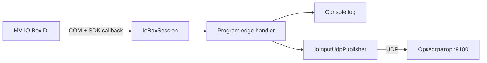

# IoInputMonitor — краткий гайд

Консольная утилита для **Digital Input (DI)** платы Hikrobot **MV IO Box**. Читает замыкание/размыкание входов через SDK (`MvIOInterfaceBox.dll`) и опционально шлёт состояние по **UDP** в оркестратор (триггер инспекции).

---

## Что делает программа

1. Открывает COM-порт IO box (не путать с COM подсветки MV-LE).
2. Подписывается на **edge callback** SDK — события при смене уровня DI (без polling).
3. Логирует фронты в консоль: `RISING` = замыкание (LOW→HIGH), `FALLING` = размыкание.
4. При `publish.udp.enabled` — отправляет `1` (замкнуто) / `0` (разомкнуто) на `host:port`.

**Семантика:** `HIGH` / `value=1` = вход **замкнут** (контакт замкнут к общему).

---

## Запуск

```powershell
cd IoInputMonitor
dotnet run
```

Из корня репозитория (подхватит `config/blocks/52-io-input.yaml`):

```powershell
dotnet run --project IoInputMonitor
```

### Полезные режимы

| Команда | Назначение |
|---------|------------|
| `dotnet run -- --list` | COM-порты Windows |
| `dotnet run -- --probe` | Найти COM, на котором реально IO box с DI |
| `dotnet run -- --scan --com COM3` | Однократно показать уровни DI1..DI8 |
| `dotnet run -- --com COM3 --input 3` | Монитор только DI3 (переопределяет конфиг) |
| `dotnet run -- --help` | Справка |

**Сборка exe:**

```powershell
dotnet publish -c Release -r win-x64 --self-contained false
```

Рядом с exe должны лежать `MvIOInterfaceBox.dll`, `MvSerial.dll` (копируются из `ThirdParty/MVS/IO/win64/`).

---

## Структура проекта

```
IoInputMonitor/
├── Program.cs              # Точка входа, CLI, основной цикл мониторинга
├── IoBoxSession.cs         # Обёртка над SDK: open/close, DI, edge callback
├── MvIoNative.cs           # P/Invoke к MvIOInterfaceBox.dll, маски портов
├── IoBoxProbe.cs           # Сканирование COM — где висит IO box
├── IoInputConfigLoader.cs  # Загрузка config/blocks/52-io-input.yaml
├── IoInputUdpPublisher.cs  # Асинхронная отправка UDP при смене DI
├── ThirdParty/MVS/IO/win64/  # Нативные DLL SDK (не в git целиком)
└── docs/GUIDE.md           # Этот файл
```

Конфиг по умолчанию: `config/blocks/52-io-input.yaml` (ищется вверх от cwd и от папки exe).

---

## Конфигурация (`io_input` в YAML)

```yaml
io_input:
  com_port: COM3
  inputs: [3, 4]           # DI 1..8
  edge: both               # rising | falling | both
  debounce_ms: 50
  configure_sdk: true      # false — не трогать SetInput, как настроено в MVS
  publish:
    udp:
      enabled: true
      host: 127.0.0.1
      port: 9100           # = inspection_trigger.udp.bind_port оркестратора
      format: json         # {"di":3,"value":1}
      inputs: [3, 4]
      send_initial_state: false
```

Переопределение пути: env `IO_INPUT_CONFIG` или `--io-config=path/to.yaml`.

### Параметры edge

| Значение | Поведение |
|----------|-----------|
| `rising` | Только замыкание (LOW→HIGH) |
| `falling` | Только размыкание (HIGH→LOW) |
| `both` | Оба фронта; SDK умеет один фильтр на порт → после события **перевооружаем** противоположный фронт |

### Форматы UDP (`format`)

| format | Пример payload | Заметка |
|--------|----------------|---------|
| `json` | `{"di":3,"value":1}` | Рекомендуется, оркестратор `format: json` |
| `text_di` | `3:1` | |
| `byte_di` | 2 байта: `[di, value]` | |
| `byte` | `0x01` | Legacy, без номера DI |
| `text` | `"1"` | Legacy |

---

## Связь с оркестратором

```
DI замкнулся → IoInputMonitor UDP → оркестратор :9100
    → inspection_trigger (external) → запуск инспекции
```

В `config/blocks/01-core.yaml`: `inspection_trigger.udp.bind_port: 9100`, `format: json` (или `discrete` для legacy).

`value=1` — триггер «нажато/замкнуто», `value=0` — «отпущено».

### Брак / готовность / ошибка на ПЛК (дискретные входы)

При `reject.enabled` IoInputMonitor на `:9101`:

| HTTP | DO | ПЛК |
|------|-----|-----|
| `PUT /vision-ready {"value":true}` | DO1 | X4 → 140.02 |
| `PUT /vision-fault {"value":true}` | DO2 | X5 → 190.00 |
| `POST /reject {"line":1}` | DO3 | X6 → 140.08 |
| `POST /reject {"line":2}` | DO4 | X7 → 140.09 |

FINS только **D4400–D4404** (таймауты). **CIO 240.15 не используем.**

---

## Типичные проблемы

| Симптом | Решение |
|---------|---------|
| `MvIOInterfaceBox.dll не найдена` | DLL в `ThirdParty/.../win64`, пересобрать проект |
| COM открылся, но не IO box | Это MV-LE (подсветка), не DI — `--probe` |
| Порт занят `0x80000004` | Закрыть второй IoInputMonitor, MVS Client, LightServer |
| Нет событий при `edge: both` | Проверить `configure_sdk` и debounce; смотреть начальный уровень DI в логе |
| Оркестратор не реагирует | Совпадают ли port/format; `publish.udp.enabled: true` |

---

## Поток данных (кратко)


