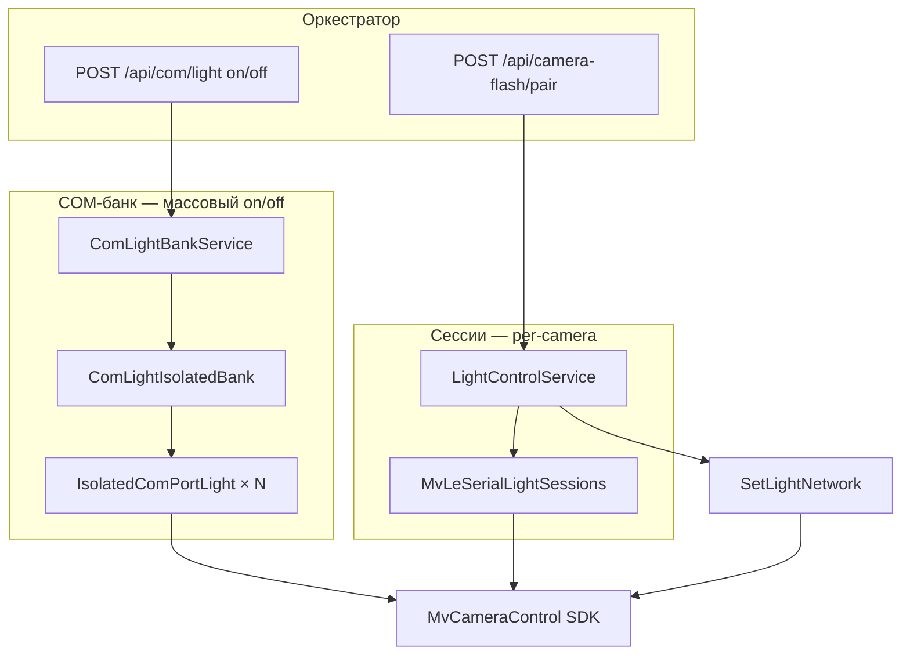

# LightServer.v3 — краткий гайд для разработчиков

HTTP-сервис управления **вспышками MV-LE** (Hikrobot): COM-подсветка, Ethernet MV-LE и маршрутизация «камера → канал». Оркестратор вызывает его перед захватом кадра.

**Базовый URL:** `http://127.0.0.1:5080` (Swagger: `/swagger`)

---

## Что делает программа

1. При старте (опционально) открывает все COM-контроллеры из конфига и держит сессии открытыми.
2. Принимает HTTP-запросы: **включить/выключить все COM**, **яркость по камере**, **прямое управление сетевым MV-LE**.
3. Через SDK **MvCameraControl.Net** пишет GenICam-узлы `LightControllerSelector`, `LightControllerSource`, `LightBrightness`.
4. Для синхронной вспышки нескольких COM использует **двухфазный протокол** (prep → barrier → fire) или **broadcast On**.

Координаты «какая камера на каком канале» задаются в `config/blocks/51-light-hardware.yaml`, не в оркестраторе.

---

## Запуск

```powershell
cd LightServer.v3
dotnet run
# или из корня репо:
dotnet run --project LightServer.v3 --urls http://127.0.0.1:5080
```

Сборка для оркестратора:

```powershell
dotnet publish LightServer.v3 -c Release -r win-x64 --self-contained false
```

Рядом с `LightServer.dll` должны лежать DLL из `ThirdParty/MVS/Runtime/win64/` и `ThirdParty/MVS/DotNet/`.

Проверка: `GET http://127.0.0.1:5080/api/com/light` → статус банка COM.

---

## Структура проекта

```
LightServer.v3/
├── Program.cs                    # DI, Kestrel, загрузка конфига
├── Configuration/
│   └── LightConfigLoader.cs      # config/blocks/51-light-hardware.yaml
├── Controllers/
│   ├── ComLightApplyController.cs   # POST /api/com/light — on/off всех COM
│   ├── CameraFlashController.cs     # /api/camera-flash/pair|single
│   ├── ComLightController.cs        # GET /api/com/devices
│   └── LightController.cs           # сеть: /api/devices, /api/light
├── Services/
│   ├── ComLightIsolatedBank.cs      # изолированный банк: 1 COM = 1 device + lock
│   ├── IsolatedComPortLight.cs      # open/prep/fire для одного COM
│   ├── ComLightBankService.cs       # логика on/off + яркость %
│   ├── LightControlService.cs       # SDK MV-LE: COM (сессии) и сеть
│   ├── MvLeSerialLightSessions.cs   # кэш EnumDevices + долгоживущие сессии
│   ├── MvLeFlashSync.cs             # Hold / Deferred / Direct / broadcast
│   ├── MvLeApplyState.cs            # кэш состояния (пропуск повторных On)
│   ├── MvsComPortEnumerator.cs      # SetEnumSerialPorts (глобальный в SDK!)
│   ├── LightHardwareRegistry.cs     # lookup devices + camera_routes (hot-reload)
│   ├── IoControllerComService.cs    # альтернатива через MvIOInterfaceBox.dll (legacy)
│   └── MvsSdkLifetime.cs            # SDKSystem.Initialize/Finalize
├── appsettings.json              # SerialLight, ComLightDevices (fallback)
└── docs/GUIDE.md
```

---

## Два пути управления подсветкой

| Путь | SDK | Когда используется |
|------|-----|-------------------|
| **MV-LE (основной)** | `MvCameraControl.Net` | COM MV-LE, Ethernet MV-LE — GenICam `LightController*` |
| **IO Box (legacy)** | `MvIOInterfaceBox.dll` | `IoControllerComService` — зарегистрирован, но **не** в HTTP API v3 |

**Важно:** на одном COM может висеть либо MV-LE (подсветка), либо IO box (DI) — это разные устройства. COM1/COM2 часто MV-LE, COM3 может быть IO box (см. IoInputMonitor).

---

## Конфигурация

### `config/blocks/51-light-hardware.yaml` (основной)

Читает только LightServer (оркестратор не парсит).

```yaml
light_hardware:
  initialize_on_startup: true
  devices:
    - id: com3
      type: com
      com_port: COM3
      channels: 4          # channels: 2 → [1,2]; [1,3] → явный список
    - id: mv-le-1
      type: ethernet
      ip: "169.254.57.1"
      channels: 4
  camera_routes:
    - camera_number: 1
      device_id: com3
      channels: [1, 2]     # pair: два канала на камеру
    - camera_number: 9
      device_id: com1
      channels: [1]        # single: один канал
```

Переопределение: env `LIGHT_HARDWARE_CONFIG` или `--light-config=path`.

**Разница `devices.channels` vs `camera_routes.channels`:**
- `devices.channels: 4` — сколько каналов у контроллера (для банка on/off).
- `camera_routes.channels: [1,2]` — какие каналы у **конкретной камеры** (для `/pair`).
- `camera_routes.channels: 2` — **один** канал №2 (для `/single`).

### `config/blocks/50-lighting.yaml` (оркестратор)

Куда оркестратор шлёт запросы:

```yaml
light_servers:
  base_url: "http://127.0.0.1:5080"
  urls:
    on: /api/com/light
    off: /api/com/light
    brightness_pair: /api/camera-flash/pair
    brightness_single: /api/camera-flash/single
  hold_mode: true
  brightness_percent: 20
  flash_lead_ms: 80
```

### `appsettings.json` (тонкая настройка SDK)

| Секция | Ключ | Смысл |
|--------|------|-------|
| `SerialLight` | `FlashSyncMode` | `Direct` / `Hold` / `Deferred` / `Auto` — как зажигать один COM |
| `SerialLight` | `BankFlashMode` | `On` = broadcast On; `Trigger` = Timer + software trigger |
| `SerialLight` | `KeepDeviceOpen` | не закрывать device после запроса (быстрее) |
| `SerialLight` | `PreconfigureBrightnessOnOpen` | при Open записать яркость на 1–4, On только меняет source |
| `SerialLight` | `DisableSdkLock` | **эксперимент** — без lock (гонки) |
| `ComLightDevices` | `Devices` | fallback, если нет YAML |

---

## HTTP API

### Массовое on/off (оркестратор)

```http
POST /api/com/light
Content-Type: application/json

{ "state": "on", "brightness": "20,20,20,20" }
```

- `brightness` — проценты 0–100 через запятую; одно число — на все каналы всех **подключённых** COM.
- Неподключённые COM **пропускаются** (partial mode) — успех, если хотя бы один COM ready.
- `GET /api/com/light` — статус: `readyDevices`, `skippedPorts`, порядок каналов.

### Яркость по камере

```http
POST /api/camera-flash/pair
{ "cameraNumber": 1, "leftPower": 51, "rightPower": 51 }

POST /api/camera-flash/single
{ "cameraNumber": 9, "power": 51 }
```

- `leftPower`/`rightPower`/`power` — **0..255** (сырая яркость SDK), не проценты.
- Маршрут из `camera_routes`; COM → `LightControlService.ApplyComPort`, Ethernet → `SetLightNetwork`.
- `GET /api/camera-flash/routes` — отладка маршрутов (hot-reload YAML).

### Сеть (Ethernet MV-LE)

```http
GET  /api/devices
POST /api/light
{ "ipAddress": "169.254.57.1", "lightControllerSource": "On", "channels": [1,2], "brightness": [200,200] }
```

### Перечисление COM

```http
GET /api/com/devices?ports=COM1,COM3
```

Перед enum вызывается `SetEnumSerialPorts` — **глобальный фильтр SDK**, влияет на все потоки.

---

## Архитектура: два контура COM



**Почему два контура:**
- **Isolated bank** — каждый COM со своим `IDevice` и lock; параллельный prep + `Barrier` для одновременного fire (синхронная вспышка всех стоек).
- **MvLeSerialLightSessions** — общий кэш `EnumDevices`, сессии для точечных запросов `/pair` (меняет яркость одной камеры без трогания остальных).

---

## Режимы вспышки (MvLeFlashSync)

MV-LE не всегда умеет «включить 4 канала одновременно» напрямую. Сервер подбирает стратегию:

| Режим | Поведение | Когда |
|-------|-----------|-------|
| **Direct** | Поочерёдно: selector → brightness → source=On | `FlashSyncMode=Direct`, простые устройства |
| **Hold** | Фаза 1: все каналы → Timer1+яркость; фаза 2: один software trigger; опционально sustain On | Рекомендуется для синхронной вспышки |
| **Deferred** | Timer-импульс без удержания | Краткая вспышка |
| **Broadcast** | Селектор `All` → один source на все каналы | Если устройство поддерживает |

**Банк (`BankFlashMode`):**
- `On` / `Direct` / `Broadcast` — `ApplyBankDirectOn`: яркость + broadcast On за один проход.
- `Trigger` — двухфазно: `PrepareBankFlash` (arm Timer) → `FireBankTriggerOnly` (software trigger).

`MvLeApplyState` запоминает «hardware armed» (Timer1 выставлен) — повторный On может только дёрнуть trigger без перезаписи яркости.

---

## Поток запуска

1. `LightConfigLoader` ищет `51-light-hardware.yaml` вверх от cwd/exe.
2. `LightHardwareBindingPostConfigure` подставляет COM-устройства в `ComLightDevices` и `SerialLight.EnumPorts`.
3. `MvsSdkLifetime` → `SDKSystem.Initialize()`.
4. `ComLightBankHostedService` (фон) → `ComLightIsolatedBank.InitializeAll()`:
   - один `SetEnumSerialPorts(все COM)`;
   - для каждого COM — `Open`, probe flash plan;
   - неоткрывшиеся → `skippedPorts` (partial OK).
5. Kestrel слушает `:5080`.

Оркестратор запускает с `cwd = корень репо`; `ContentRootPath = BaseDirectory` (папка exe) — appsettings читается из bin.

---

## Связь с оркестратором

Типичный цикл инспекции:

```
триггер DI → оркестратор
  → POST /api/com/light { state: on, brightness: "20,..." }
  → flash_lead_ms (пауза)
  → camera-worker захват
  → POST /api/camera-flash/pair (точная яркость per camera, опционально)
  → POST /api/com/light { state: off }
```

`hold_mode: true` в `50-lighting.yaml` — свет остаётся гореть между кадрами одной инспекции.

---

## Типичные проблемы

| Симптом | Причина | Решение |
|---------|---------|---------|
| `Building…` зависает | Синхронный Open COM блокировал старт | Инициализация в фоне (`ComLightBankHostedService`) — дождаться лога «COM-банк готов» |
| Open `0x800000FF` | COM занят MVS Client / второй LightServer | Закрыть MVS, один экземпляр сервера |
| COM в конфиге, но `skipped` | На порту нет MV-LE (IO box / пусто) | `GET /api/com/devices`, проверить кабель; не путать с IoInputMonitor |
| `Simultaneous On unavailable` | Нет Timer trigger и нет broadcast | `FlashSyncMode: Hold` или настроить Timer1 в MVS |
| EnumDevices пустой | `SetEnumSerialPorts` не вызван / неверный COM | Проверить `51-light-hardware.yaml`, закрыть MVS |
| Яркость «не та» на /pair | 0–255 vs проценты | `/pair` — raw 255; `/api/com/light` — проценты 0–100 |
| cameraNumber не найден | Нет в `camera_routes` | `GET /api/camera-flash/routes` |
| Изменил YAML — не видно | Hot-reload только routes/devices lookup | `camera_routes` перечитывается; COM-банк — **перезапуск** |
| `DisableSdkLock=true` | Эксперимент в appsettings | Вернуть `false` для продакшена |

---

## GenICam-узлы (справка)

| Узел | Назначение |
|------|------------|
| `LightControllerSelector` | Канал 1–4 или `All` |
| `LightControllerSource` | `On`, `Off`, `Timer1`..`Timer4`, `In1`..`In4` |
| `LightBrightness` | 0–255 (имя узла может отличаться — перебор кандидатов) |
| `TimerTriggerSoftware` | Software trigger для Hold-режима |

Числовые значения source: On=1, Off=255, Timer1=14, …
