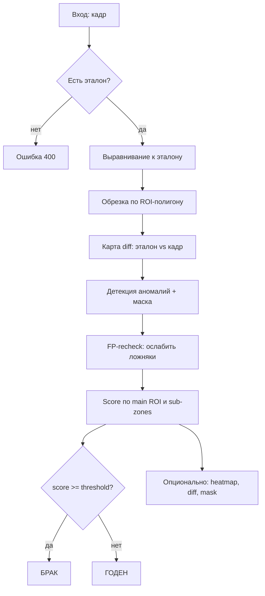

# analisSurface — краткий гайд для разработчиков

Сервис сравнивает **текущий кадр** с **эталоном** и решает: **ГОДЕН** или **БРАК**. Работает как HTTP API (FastAPI). В продакшене его вызывает Java-оркестратор; для ручной проверки можно использовать multipart-эндпоинты.

**Базовый URL:** `http://127.0.0.1:8000`

---

## Что делает программа

1. Хранит эталонное изображение для каждого `product_type` (тип изделия / профиль анализа).
2. Принимает кадр с камеры (файл или shared memory).
3. Выравнивает кадр по эталону, считает карту отличий, ищет аномалии.
4. Возвращает вердикт, числовой score и (опционально) визуализации: diff, heatmap, маску.

Координаты ROI и FP-зон задаются в **нормализованном виде** `[0, 1]` относительно размера изображения.

---

## Запуск

(Если что может быть не pip а pip3)

```powershell
cd analisSurface/backend
python -m venv .venv
.\.venv\Scripts\Activate.ps1
pip install -r requirements.txt
python -m uvicorn app.main:app --reload --port 8000
```

Проверка: `GET /health` → `{"status":"ok", ...}`

---

## Структура проекта

```
analisSurface/
├── backend/
│   ├── app/
│   │   ├── main.py                 # Точка входа FastAPI, CORS, middleware (detector_id в JSON)
│   │   ├── runtime.py              # ID процесса-детектора (detector_id)
│   │   ├── api/
│   │   │   ├── routes.py           # Сборка всех роутеров
│   │   │   ├── schemas.py          # Pydantic-модели запросов/ответов
│   │   │   ├── mappers.py          # Преобразование внутренних результатов → API
│   │   │   ├── dependencies.py     # Singleton InspectionService + пул потоков inspect
│   │   │   ├── file_routes.py      # Загрузка эталона и inspect через файлы
│   │   │   ├── inspection_routes.py# Inspect через shared memory (продакшен)
│   │   │   ├── roi_routes.py       # Главный ROI-полигон
│   │   │   ├── roi_sub_zone_routes.py # Подзоны ROI с отдельными порогами
│   │   │   ├── fp_zone_routes.py   # False-positive зоны (игнор шума)
│   │   │   └── analysis_settings_routes.py
│   │   ├── services/
│   │   │   ├── inspection_service.py  # Вся логика пайплайна анализа
│   │   │   ├── inspection_models.py   # Dataclass-ы результата, зон
│   │   │   ├── inspection_geometry.py # Полигоны, маски, нормализованные координаты
│   │   │   ├── analysis_settings.py   # Параметры алгоритма (defaults + overrides)
│   │   │   └── shm_io.py              # Чтение/запись кадров в shared memory
│   │   └── data/                   # JSON с настройками и зонами (создаётся при работе)
│   │       ├── analysis_settings.json
│   │       ├── fp_zones.json
│   │       └── roi_sub_zones.json
│   └── requirements.txt
└── docs/
    ├── GUIDE.md                         # Этот файл
    ├── ANALYSIS_SETTINGS.md             # Подробно про каждый параметр алгоритма
    └── ANALYSIS_SETTINGS_SIMPLE_PRO.md  # Simple/Pro эндпоинты для инженеров
```

**Важно:** эталоны (`references`) хранятся **в памяти процесса** и теряются при перезапуске. JSON в `data/` — на диске.

---

## Два способа передачи кадров

| Способ | Эндпоинты | Когда использовать |
|--------|-----------|-------------------|
| **Файл (multipart)** | `/upload-ref`, `/inspect` | Ручная отладка, тесты без камеры |
| **Shared memory** | `/upload-ref-shm`, `/inspect-shm`, `/inspect-shm-visuals` | Продакшен: оркестратор + camera-worker |

### Общие поля SHM-кадра (`ShmFrameRequest`)

| Поле | Смысл |
|------|--------|
| `product_type` | Ключ изделия / профиля анализа |
| `shm_name` | Имя сегмента SHM (Linux: `/dev/shm/...`, Windows: `%LOCALAPPDATA%\iml_shm\...`) |
| `width`, `height` | Размер кадра в пикселях |
| `stride` | Байт на строку; по умолчанию `width * 3` для BGR |
| `shm_offset` | Смещение начала кадра внутри файла SHM |
| `threshold` | Порог брака на этот кадр (перекрывает настройки) |
| `detector_id` | ID детектора (прокидывается в ответ) |
| `alignment_h_ref_to_cur` | Опциональная матрица 3×3 гомографии от java-geometry (выравнивание) |

### Выход SHM-визуализаций (`ShmImageOutput`)

Пишется в SHM по путям из запроса. Формат: `uint8`, `channels` = 1 (gray) или 3 (BGR).

| Визуал | Формат | Назначение |
|--------|--------|------------|
| `heatmap_u8` | gray, 1 канал | Карта аномалий для UI (клиент сам раскрашивает) |
| `diff_map_u8` | BGR | Карта различий эталон vs кадр |
| `aligned_image_u8` | BGR | Выровненный текущий кадр |
| `segmentation_mask_u8` | BGR | Маска найденных дефектов |

---

## API — эндпоинты

### Служебные

#### `GET /health`
Проверка, что сервис жив.

**Ответ:** `status`, `service`, `detector_id`

#### `GET /detector/health`
То же для оркестратора: `status`, `service` = `analisSurface`, `detector_id`

---

### Эталон

#### `POST /upload-ref` (multipart)
Загрузить эталон из файла.

| Вход | Тип | Смысл |
|------|-----|--------|
| `product_type` | form | Ключ изделия |
| `file` | image | Эталонное фото (BGR после декодирования) |

**Ответ:** `message`, `product_type`, `reference_b64` (PNG в base64 для превью)

#### `POST /upload-ref-shm` (JSON)
То же, но кадр читается из SHM (`ShmFrameRequest` без `threshold`).

#### `GET /reference/{product_type}`
Вернуть сохранённый эталон как base64. **404**, если эталон не задан.

---

### Инспекция

#### `POST /inspect` (multipart)
Полная инспекция + все визуализации в base64.

| Вход | Смысл |
|------|--------|
| `product_type` | Изделие |
| `file` | Текущий кадр |
| `threshold` | Опциональный порог `(0, 1]` |

#### `POST /inspect-shm` (JSON)
Только вердикт и score, **без** тяжёлых картинок. Для конвейера на скорости.

#### `POST /inspect-shm-visuals` (JSON)
Инспекция + запись визуалов в SHM. Тело = `ShmVisualsRequest`:

| Доп. поле | Смысл |
|-----------|--------|
| `*_u8_output_path` | Куда писать каждый визуал (только запрошенные) |
| `heatmap_max_width` | Уменьшить heatmap по ширине перед записью (для UI) |

**Ответ инспекции (`InspectResponse`):**

| Поле | Смысл |
|------|--------|
| `status` | `ГОДЕН` или `БРАК` |
| `anomaly_score` | Итоговый score `0..1` (макс. по зонам) |
| `threshold` | Порог, с которым сравнивали |
| `raw_anomaly_score` | Score до FP-recheck |
| `main_roi_score` | Score по основной ROI (без дыр от sub-zones) |
| `sub_zone_scores[]` | Score по каждой подзоне + свой `threshold` и `status` |
| `rechecked_zones_count` | Сколько FP-зон перепроверили |
| `recheck_adjustment` | Насколько изменился score после FP-recheck |
| `rechecked_zone_ids` | ID перепроверенных FP-зон |
| `detector_id` | ID экземпляра сервиса |

`InspectWithVisualsResponse` добавляет `*_b64` для aligned, diff, heatmap (цветной JET), mask.

---

### ROI — область анализа

#### `POST /roi-polygon`
Задать главный полигон ROI (нормализованные точки `[0,1]`). Нужен загруженный эталон.

#### `GET /roi-polygon/{product_type}`
Получить ROI. **404**, если не задан.

---

### Sub-ROI — подзоны с отдельными порогами

Дырки внутри главного ROI: например, зона с надписью, где допустим другой порог.

| Метод | Путь | Действие |
|-------|------|----------|
| `POST` | `/roi-sub-zones` | Создать подзону (`points`, опц. `threshold`, `label`) |
| `GET` | `/roi-sub-zones/{product_type}` | Список подзон |
| `PATCH` | `/roi-sub-zones/{zone_id}` | Изменить threshold / label / points |
| `DELETE` | `/roi-sub-zones/{zone_id}` | Удалить |

Точки подзоны должны лежать **внутри** главного ROI.

---

### FP-зоны (false positive)

Области на heatmap, где известный шум/текст не должен давать брак. При срабатывании — перепроверка и ослабление score.

| Метод | Путь | Действие |
|-------|------|----------|
| `POST` | `/fp-zones` | Добавить зону |
| `GET` | `/fp-zones/{product_type}` | Список зон |
| `DELETE` | `/fp-zones/{zone_id}` | Удалить |

**Создание (`FPZoneCreateRequest`):**

| Поле | Смысл |
|------|--------|
| `points` | Полигон в норм. координатах heatmap |
| `heatmap_w`, `heatmap_h` | Размер heatmap, в котором рисовали зону (для привязки координат) |
| `note` | Комментарий |

---

### Настройки алгоритма

Параметры **на каждый `product_type`** (в API путь называется `analysis_profile`).

| Метод | Путь | Действие |
|-------|------|----------|
| `GET` | `/analysis-settings/defaults` | Заводские значения |
| `GET` | `/analysis-settings/{product_type}` | Эффективные + список overrides |
| `PUT` | `/analysis-settings/{product_type}` | Частичное обновление |
| `DELETE` | `/analysis-settings/{product_type}` | Сброс к defaults |
| `GET/PUT` | `/analysis-settings/{product_type}/simple` | 2 ручки: threshold + sensitivity |
| `GET/PUT` | `/analysis-settings/{product_type}/pro` | 6 ручек: threshold + 5 групп |

Ключевые параметры (кратко):

| Параметр | Смысл |
|----------|--------|
| `default_threshold` | Порог брака `0..1` |
| `min_defect_area` | Мин. площадь пятна (пиксели) |
| `min_diff_signal` | Игнорировать кадр, если diff слишком слабый |
| `diff_percentile` | Порог бинаризации карты diff |
| `fp_recheck_enabled` | Включить перепроверку FP-зон |
| `enable_clahe` | Выравнивание освещения перед diff |

**Подробности по каждому полю:** [ANALYSIS_SETTINGS.md](./ANALYSIS_SETTINGS.md)  
**Simple / Pro для инженеров:** [ANALYSIS_SETTINGS_SIMPLE_PRO.md](./ANALYSIS_SETTINGS_SIMPLE_PRO.md)

---

## Пайплайн анализа изображения



### Шаги подробнее (без лишней глубины)

1. **Выравнивание** (`_align_to_reference`)
   - Если оркестратор передал `alignment_h_ref_to_cur` — гомография от geometry-сервиса.
   - Иначе ORB-дескрипторы + homography; fallback — простой resize под размер эталона.
   - Финальная подстройка ECC (микросдвиг).

2. **ROI** — если задан полигон, анализ только внутри него; фон обнуляется.

3. **Diff** (`_compute_advanced_difference`) — сравнение яркости/градиентов, CLAHE (если включён), подавление краёв и текста по настройкам.

4. **Аномалии** (`_run_anomaly_model`) — эвристика по connected components на diff (царапины, пятна).

5. **FP-recheck** — для зон из `fp_zones.json`: если всплеск diff похож на известный шум, score снижается.

6. **Вердикт** — `anomaly_score` = максимум из main ROI и всех sub-zones; сравнение с `threshold`.

7. **Heatmap** — одноканальный `gray_u8` (энергия аномалии + diff). В SHM для UI; цветной JET — только в base64-ответе `/inspect`.

---

## Типичный сценарий (продакшен)

```
1. Оркестратор → POST /upload-ref-shm     (эталон в SHM)
2. Оркестратор → POST /roi-polygon        (если нужен ROI)
3. На каждом кадре:
   a. POST /inspect-shm                   (быстрый вердикт)
   b. POST /inspect-shm-visuals           (heatmap в SHM для UI)
4. UI читает heatmap по пути из ответа
```

Ручная отладка без SHM:

```
POST /upload-ref  →  POST /inspect
```

---

## Частые ошибки

| Симптом | Причина |
|---------|---------|
| `Reference is not set` | Не загружен эталон для `product_type` |
| `422 validation error` | Неверное тело JSON (смотреть лог uvicorn) |
| `shared memory file not found` | Нет файла в `iml_shm` / неверный `shm_name` |
| Пустой heatmap в UI | Не вызван `/inspect-shm-visuals` или не задан `heatmap_u8_output_path` |
| После рестарта нет эталона | Эталоны только в RAM — нужен повторный `upload-ref` |

---

## Связанные документы

- [ANALYSIS_SETTINGS.md](./ANALYSIS_SETTINGS.md) — все параметры алгоритма
- [ANALYSIS_SETTINGS_SIMPLE_PRO.md](./ANALYSIS_SETTINGS_SIMPLE_PRO.md) — упрощённые эндпоинты simple/pro
- [ANALYSIS_SETTINGS_UI.md](./ANALYSIS_SETTINGS_UI.md) — названия и подсказки для фронта
- [README.md](../README.md) — запуск, камера, оркестратор
